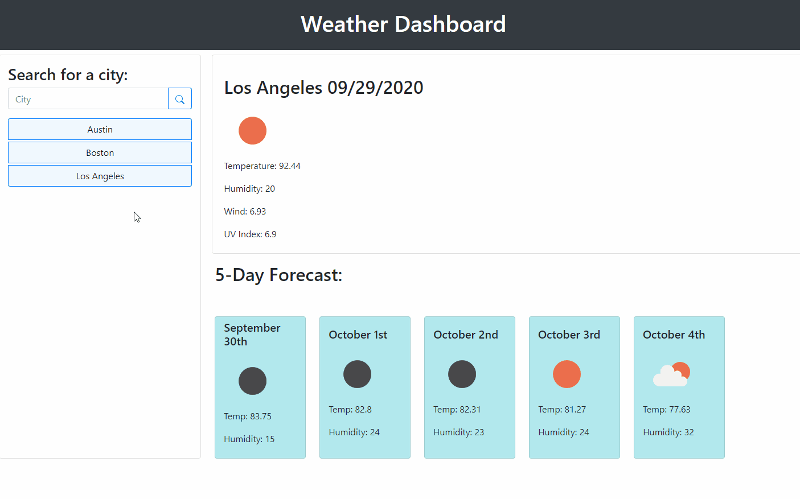

# Weather Dashboard 
[](https://www.mit.edu/~amini/LICENSE.md)
<br>
This webpage is a Weather Dashboard providing you with current weather info and a 5 day forecast for any U.S. city or state. Cities can be searched for on the page and the user will be displayed the results. Results include temperature, humidity, wind, and the UV Index. The bottom of the page will display the 5 day forecast for the location that has been chosen. When the page is first opened up the default location is Los Angeles (a tribute to my home). 
  
 ## Built With
* JavaScript (jQuery)
* HTML
* CSS

## APIs/Libraries
* [Open Weather Map](https://openweathermap.org/api)
* [Moment.js](https://momentjs.com/)

## Features
The Weather Dashboard includes a search history for quick access to former searches. It uses Moment.js to display the current date and the dates of the 5 day forecast. Weather data is grabbed from ajax calls to Open Weather Map API. The page is fully responsive and mobile friendly.
<br>



<br>

## Code Example
An AJAX call is used to grab the current weather data from Open Weather Map.

<br>  

```javaScript

//Display new city function
function displayCityInfo(){
    var city = $(this).attr("data-name");
    var queryURL = "https://api.openweathermap.org/data/2.5/weather?q=" + city + "&units=imperial&appid=16e99cc70c7cbbdcf35ae6166af0f447"
    $.ajax({
        url: queryURL,
        method: "GET"
      }).then(function(response) {
          //console.log(response);
          $(".currentCity").text(response.name +"  "+ moment().format('L'))
          $(".temp").text("Temperature: " + (response.main.temp));
          $(".humid").text("Humidity: " + (response.main.humidity));
          $(".wind").text("Wind: " + (response.wind.speed)); 
          

```

<br>
A function is called to display the history of user searches. The "new Set" ensures that repeated searches aren't repeated in the button history.
<br>
<br>

```javaScript

//create array for history
var searchHistory = ["Los Angeles"]
var get = JSON.parse(localStorage.getItem("array"))
if(get !== null){
  searchHistory = get
  renderButtons();
}

//render history buttons
function renderButtons(){
    $(".addHistory").empty();

    let newSet = new Set(searchHistory);
    searchHistory = [...newSet];

    for(var i=0; i < searchHistory.length; i++){
        var b = $("<button>");
        b.addClass("history mb-1 btn btn-primary");
        b.attr("data-name", searchHistory[i]);
        b.text(searchHistory[i])
        $(".addHistory").prepend(b);
       
    }
}.

```

<br>
An on click listener was added to the search button to add the value of the search term to the history button list. New items pushed to the array are included in local storage to be saved for a new session.

<br>
<br>  

```javaScript
$(".searchBtn").on("click", function(event){
    event.preventDefault();


    var city = $("#searchCity").val();

    if(city === ""){
      return;
    }
  
    searchHistory.push(city);
    
    localStorage.setItem("array", JSON.stringify(searchHistory));

    $("#searchCity").val("")
    renderButtons();  
```
<br>

# Deployed Link:
https://joshglugatch.github.io/day-planner/

<br>

# Repository Link:
https://github.com/joshglugatch/day-planner

<br>

### Author:
Josh Glugatch  

[](https://github.com/joshglugatch)
<br>
[](www.linkedin.com/in/joshua-glugatch)


